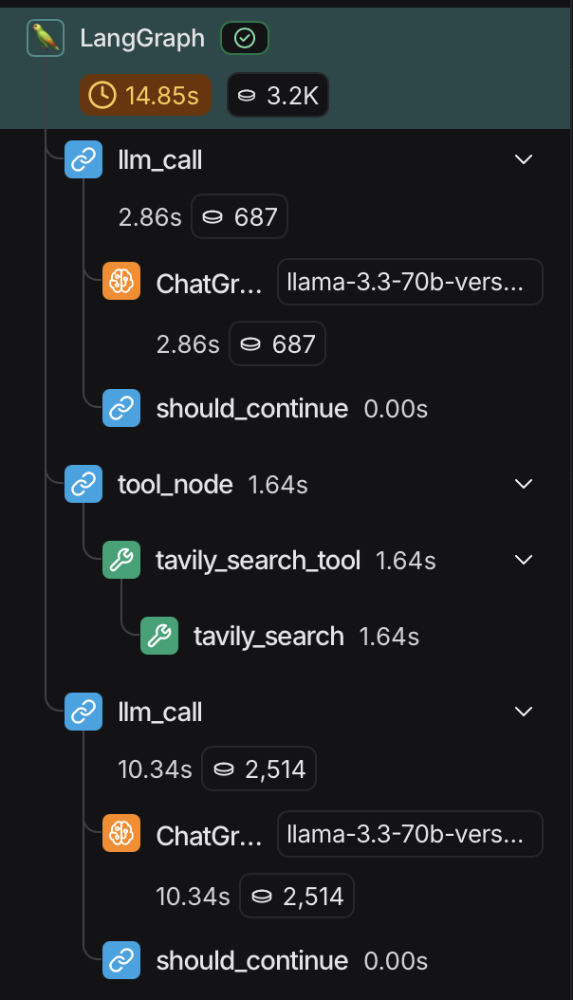
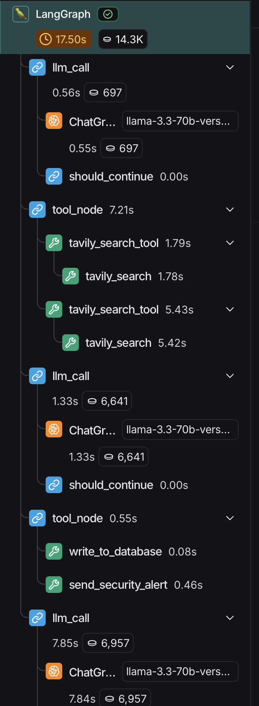
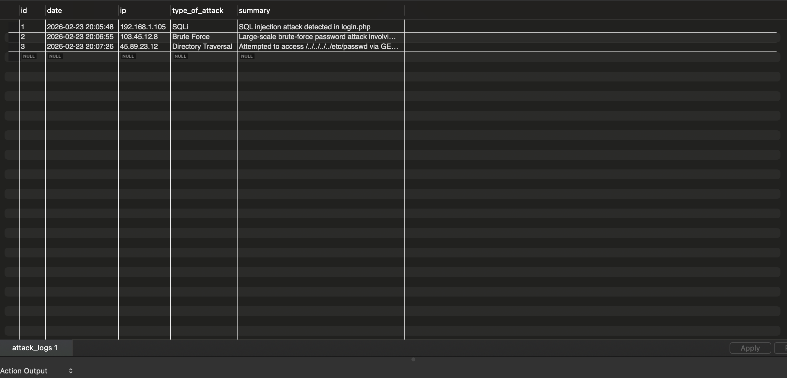
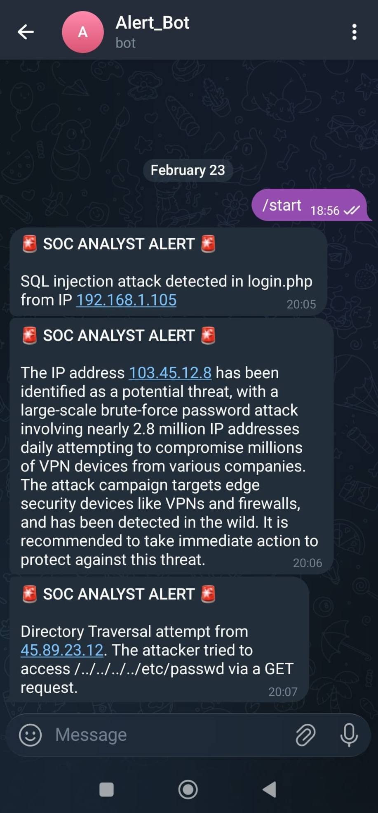

# 🛡️ AI SOC Analyst: Intelligent Security Monitoring System

This project is an **AI-powered Security Operations Center (SOC) Agent** that monitors server logs (`server_logs.txt`) in real-time. It doesn't just look for keywords; it acts like a **Senior Security Analyst** to evaluate suspicious activities and take autonomous actions.

By leveraging **Llama 3.3 (via Groq)** and **LangGraph**, the system analyzes the logic behind attacks such as SQL Injection (SQLi), Cross-Site Scripting (XSS), Brute Force, and Directory Traversal.

---

## 🧩 System Execution & Logic Flow

Below is the step-by-step execution flow of the agent, showing how it distinguishes between routine traffic and actual cyber threats.

###  1. Benign Analysis (Safe Path)
When the AI Analyst determines a log entry is safe, it terminates the process immediately to save resources and avoid alert fatigue.

*LangSmith trace showing the decision-making process for a harmless log entry.*

---

###  2. Malicious Analysis (Threat Path)
When a threat (SQLi, XSS, etc.) is detected, the agent triggers a deep investigation, searching for IP reputation and payload signatures via Tavily.

*LangSmith trace showing the agent conducting research and executing defensive tools.*

---

###  3. Server & Database Logs
All confirmed threats and their AI-generated forensic summaries are recorded in a structured MySQL database.

*MySQL Database view of recorded security incidents and attack details.*

---

###  4. Telegram Threat Alert
The administrator receives an instant notification with the attack severity, analysis, and recommended actions.

*Real-time security alert sent by the AI Agent to the administrator's Telegram.*

---
## ✨ Key Features

* **🔍 Intelligent Analysis:** Uses Llama 3.3 to understand the intent and severity of log entries.
* **🌐 Live Threat Intelligence:** Automatically researches suspicious IPs and payloads using **Tavily Search**.
* **🚨 Multi-Channel Response:**
    * Sends instant alerts to the administrator via **Telegram** for confirmed threats.
    * Logs all incident details and AI-generated summaries into **MySQL**.
* **🔄 Advanced Decision Logic:** Managed by a **LangGraph** state machine to ensure a reliable and traceable analysis flow.

📋 How It Works
Ingestion: The agent monitors server_logs.txt for new entries.

Reasoning: The AI analyst evaluates the log. If it's safe (Benign), the process ends.

Investigation: If suspicious, the agent triggers a search for the IP reputation or payload signatures using Tavily.

Decision & Action: If a threat is confirmed, it executes two parallel actions: sends a Telegram alert and writes to the MySQL database.

## 🛠️ Tech Stack

* **Frameworks:** LangChain & LangGraph
* **LLM:** Groq (Llama-3.3-70b-versatile)
* **Data & Tools:** MySQL, Telegram Bot API, Tavily Search API
* **Language:** Python 3.x
